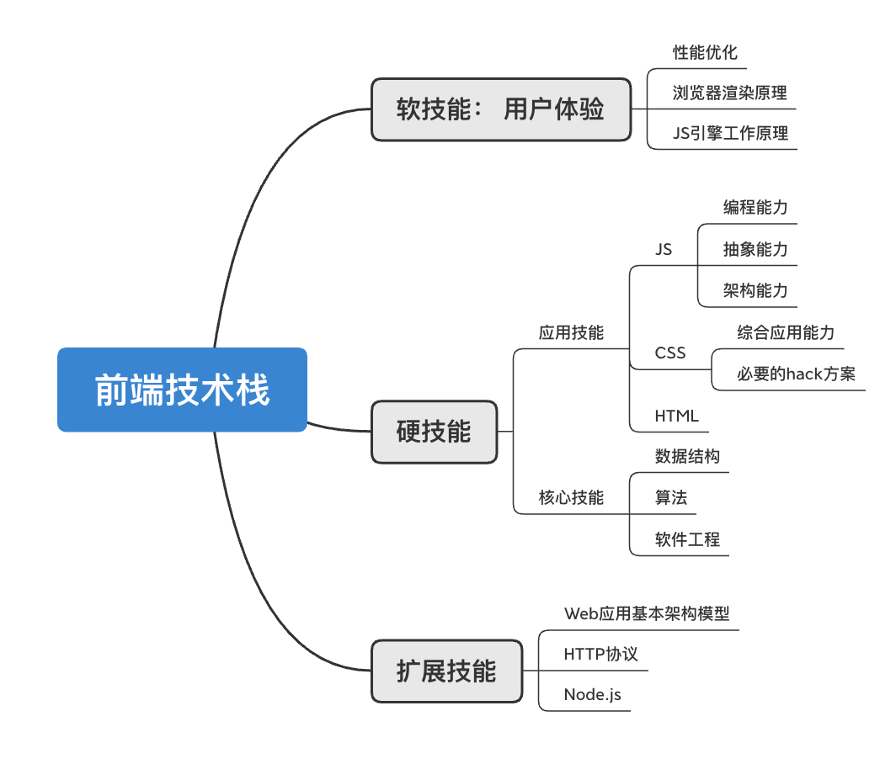

# 前端工程化学习 

### 一、前端工程概述

>  前端工程化应该看作一系列流程和规范，而不能单纯地认为是工具或者框架。其目标是解决前端开发和前后端协作开发过程中的难点痛点，涵盖项目的起始、开发、测试以及部署等环节。
>
> 工具是前端工程化的实现媒介，而规范则是工程化的直到方针，而工作流程则是工程化的外在表现以及约束规范的载体。

前端范围内的客户端的功能和逻辑日渐复杂，前端工程化也是大势所趋。

 

##### 1、前端工程师需要做到哪些

 如上图是一个前端工程师所需要的技能列表（比较简单，仅参考）

*关于用户体验，需要做到：

- 保证内容的快速展现，减少用户等待时间
- 保证操作的流畅性
- 移动设备则要尽量减少设备耗电量

其实也就是性能了。完成业务只是保证了“量”，而提高性能则是确保了“质”，两者缺一不可。

 

*关于扩展技能： 前端工程师不仅仅是前端部分的技能要硬，也需要熟悉Web应用的整体框架，即对后端的基础知识也要具备。这有助于前后端协作和提高效率（比如体现在mock等）

前端不仅对接后端，还需要对接产品、UI，是一个非常重要的定位。

 

##### 2、前端的变革

- AJAX技术的出现
- Node.js的出现

Node.js的出现契机： 在上传的时候想要上传完成的同时获得服务器的推送，而不是轮询服务器，这就是Node.js实现异步操作的核心Event Loop的雏形。

Node.js的出现让JavaScript进入了服务器开发领域。

Node.js继承了V8引擎、事件驱动、底层I/O API，并提供了JS开发服务端应用的环境，可以直接提供网络环境给开发各种工具带来很多便利。

 

Node.js支持服务端应用开发和同构JavaScript开发（各种前端应用框架的SSR实现）。

*同构： 数学领域的术语，指的是数学对象之间的属性或者操作关系的一类映射。数学中研究同构是为了将数学知识应用于更多不同的领域。

JS的同构也是为了将JS推向不同开发领域。即前端代码能在浏览器和服务端运行

 

SPA（单页面应用）相对于传统的依赖服务器渲染的网站，其视图都由浏览器渲染，除了静态资源之外只传输数据，减少了服务器渲染HTML和网络传输的资源消耗。而且SPA使用的页面路由也更加快速灵活。

不过这也带来了一些问题，比如SPA需要等待JS加载完成后才能渲染后续HTML内容，等待时页面是空白的，也就是“白屏时间”。过长的等待时间对用户体验非常不好。

有一个潜在的缺点就是前端的路由结构可能会和后端的路由冲突，当然这有不少的方式去规避。

另外一点就是SPA网站在SEO上不太理想，因为很多爬虫并不支持SPA的渲染，这也是SPA应用需要同构开发来解决的（SSR： 服务端渲染）。

 

##### 3、前后端分离

因前端的快速发展和SPA大量应用，使得传统的前后端耦合的串行开发模式不再适用。为寻求高效协作，现在都是推行前后端分离的开发模式。这也催生了前后端分离这一概念。

前后端分离指的是前端工程师和后端工程师进行明确的合理分工，改善因协作而拖慢开发进度的一种模式，体现在开发流程上的话，如下：

> 1. 开发上，前后端要并行开发，缩短开发周期
> 2. 测试上，前后端分离后能更快地、准确地定位问题
> 3. 部署上、前后端的部署分离能让流程更自由、也方便回滚，增强应用的健壮性

 

##### 4、前后端分离模式上的解析

对于前端来讲，和后端的交互都是基于数据的。也就是从后端获得数据，以及将前端产生的数据传过去。

- 开发上： 技术选型相关，一般上主流的框架都是SPA框架；关于数据的问题，需要确定初始数据和接口数据。这可以通过先定好数据结构，搭建Mock服务来解决
- 测试上： 单测是相互独立的，结果不会影响对方；而集成测试则是联动的，需要测试工程师来遍历测试用例。出现问题的时候，要前端工程师来定位和处理问题（因为前端工程师是直接对接测试工程师/用户的），做好“BUG路由器”的职责（笑）。另外可以使用一些客户端监控系统来追踪bug，及时通知开发人员来处理。
- 部署上：

  1. 缓存策略： SPA应用不能强缓存index.html，可以单独使用协商缓存策略；其他静态资源则可以使用强缓存策略
  2. 分开部署有个好处就是，在集成测试阶段，出现bug，定位完修复后可以直接更新部署，不会影响到另一方

 

##### 5、前端工程化相关

在工程化上有这么几个衡量准则： 快、准、稳。

>* 开发上速度快。
>
>* 测试上的快体现在使用单测来降低出现逻辑性错误，降低时间成本；准则体现在集成测试阶段对问题的快速定位。
>
>* 部署上的稳：部署是一个完整迭代周期的末尾，需要考虑缓存、测试用例没有100%覆盖的危机处理、灰度测试等。

前端工程化在进化上有这么些历程：

1. 混沌状态：以前那种模板混杂，前后端耦合，没有完备工具链的时候。

2. 前后端分离状态：

   AJAX变革后，虽然比混沌状态好不少，但是还有这些问题：

* 浏览器版本、兼容的问题，需要对使用es6+语法的代码进行转换
* css不好用，要用less/sass/postcss     等，还是需要工具转换
* URL替换需要工具
* 模块化需要工具
* 接口对接需要mock
* 静态资源和动态文件在统一项目中，产出依旧依赖于后端

 

为了解决上面的问题，衍生了这么些步骤、方法：

* 第一步： 构建流程

  编译转码、图片转base64、模块依赖分析、压缩打包、资源定位等。这些单方面提高了前端的工作效率。

* 第二步：加入本地开发服务器

  如Mock服务的使用、自动构建的热更新开发服务器、支持SSR。由于所有客户端相关的资源都由前端负责，后端不需要对前端的产出进行二次处理，只需要一次交付即可；可使用git等版本管理工具替代人工交付，对代码回滚也提供了更严谨的技术支持。

* 第三步： 静态资源和动态资源的分离部署

  在以往前后端没分离的情况下，前端的细小bug，在更新后还需要后端工程师进行部署，效率极其低下。在前后端分离后可以减少耦合工作，可以提高迭代和维护效率。其高效主要体现在集成测试阶段，分离部署互不影响对方的工作。

 

工程化中规范体现在：

- 项目文件的结构目录
- 源代码的开发模式（使用哪种模块化方案）
- 工具使用规范（工程化自身的配置规范）
- 各阶段环境的依赖（如部署功能的实现需要目标服务器的ssh权限）

 

前端工程化的三个阶段

1、本地工具链

工具统一利于流程规范，有益于协作与维护，提高效率

2、管理平台——淡化差异、加深规范

本地工具链容易出现“在我电脑上不是这样子的”的情况

还有就是对生产环境的误操作

 

淡化环境差异性、保证构建产出的一致性

需要权限的集中管理、提高安全性

项目版本的集中管理，便于危机处理，如版本回滚

 

3、持续集成——前端工程化的目标就是融入整体

前后端的工作是独立的，但在融合的时候免不了需要人工操作

（比如版本回滚时要和后端同步回滚）

前端工程化是web工作流的一个子集方案，为了更好的改进前端工程化，需要和整体工作流结合，作为持续集成方案的一环

 

 

6、工程化方案架构

目前的前端工具主要有三类：

工作流管理工具： grunt glup

构建工具： webpack rollup

整体解决方案： FIS Weflow

 

本地工具链和云管理平台形态的前端工程化方案的区别在于： 云端集中管理构建 部署功能，保证构建结果一致性，并便于管理权限

 

一个前端项目的迭代周期有三个阶段： 开发、测试和部署上线

 

设计原则：

规范设计原则： 用户至上

1、工程化方案本身的配置API规范： 着重于配置项简明

2、编程范式的约束规范：着重于代码的可移植性，减少对代码的捆绑性

 

架构设计原则： 扩展至上

能够灵活地（以小成本）支持各种需求

 

 

### 二、脚手架：

一句话概括功能： 创建项目初始文件。本质就是对方案的封装

 

脚手架容易被“用完即弃”

 

前端工程体系 不是指React、Vue这些业务开发框架，是一种“服务”

一套合理的前端工程体系下，业务开发人员的关注点应该在业务开发上，而不是这套前端工程体系的学习和配置上。

合理的要素： 平缓的学习曲线

 

脚手架应该解决：

- 快速生成配置
- 降低框架学习成本
- 让业务开发人员关注于业务逻辑本身

 

流程： 脚手架 开发 构建 部署测试 测试 部署上线

本地环境： 开发机的环境 （构建和部署测试在本地进行）

集成平台环境： 云管理平台或持续集成平台环境（构建和部署测试在集成平台进行）

测试环境： 集成测试阶段，测试工程师对产品进行仿真测试的沙箱环境

生产环境： 交付给用户的真实使用环境

 

脚手架因为只在本地运行，需要考虑OS的差异

 

 

### 三、构建

 

1、构建功能要解决的问题

在glup grunt webpack这些工具出来之前，前端资源构建需要借助其他开发领域的工具来实现，也就是需要其他语言环境。Node.js的出现使得前端工具生态不断壮大。

前端项目的复杂化是推动前端工具发展的环境因素

 

构建（或者叫编译），在前端工程体系中的角色就是将源代码转化成宿主浏览器可以直接执行的代码，核心就在于资源的管理。

除了语言，前端资源的构建处理还需要考虑web应用的性能因素，也就需要以下功能：

- 依赖打包——分析依赖关系，将同步依赖的文件打包到一起，减少HTTP请求数
- 资源嵌入——比如小于10kb的图片就转换成base64格式嵌入文档，减少请求数
- 文件压缩——减少文件体积，缩短请求时间
- hash指纹——给文件名加上hash指纹，应对浏览器缓存策略

这些功能是提高web应用的性能和用户体验，可以理解为面向优化的

 

html文件和js、css、图片等资源的关系是引用和被引用。被引用的资源会有这样的变动：

- 域名/路径改变——开发环境和生存环境的差别，有些还上CDN
- 文件名改变——如加上hash指纹

这些功能通常称为资源定位，可以理解为面向部署的

 

2、配置api设计原则和编程范式约束

配置api需要简单明了，webpack虽然自由但是配置起来很麻烦

有些方案封装会带来便利的同时，需要业务代码编程范式遵循既定的约束，会让源代码的可移植性受到一定程度的限制

如css sprite功能要求图片路径带上sprite标记，这使得更换构建工具的时候这种标记会变成冗余代码。即使没有冲突的话，这种url后面带有query参数的标记会影响浏览器缓存策略

 

虽然最新的ECMAScript带来不少便利，不过浏览器对ES的支持程度远落后于规范的更新。不过有Babel这个神器

在Babel出现之前，JS编程都是面向浏览器编程的，各种hack层出不穷。

技术选型，api的使用最重要的考虑因素就是浏览器的兼容性

调兼容性需要花费大量精力时间

 

移动web的新兴和旧浏览器的市场份额逐渐降低，也是Babel能大规模应用的因素

 

Babel能将新版本的ES语法转化成可运行的低版本语法，可以根据具体的配置参数来决定编译输出的具体语法，所有参数都由项目针对的浏览器特性决定，如需要支持IE8就将ES6语法转化成ES3语法

 

Babel能称为编译的原因就在于能将不能运行的代码转换成目标浏览器能运行的版本。Babel将兼容性问题的处理从人工层面移到了工具层面。具体案例可以参考CSS预编译器。

 

**实际上CSS开发领域中的某些理念是领先于JS的，比如比Babel更早就有了的各种预处理器。PostCSS有点像是Babel，因为鼓励开发人员直接编写规范的CSS代码，将hack和sprites等工作交给PostCSS。但是CSS的弱编程能力，目前的方案就是使用CSS预编译与PostCSS综合使用

 

3、Babel

Babel结合Webpack使用：Babel-loader

webpack使用babel需要注意： 

- babel-preset-env的使用（环境包？     用于检测目标浏览器的版本，会自动帮你转化目标不支持的语法，支持的语法就不转了）

（具体参考语法，可以自定义版本、可以按照市场份额来）

（比如开发electron的话就可以设置，增加原生支持的语法的覆盖率）

（这个包只支持已经发布和确定会加入下一版本规范的特性，stage0到stage3是不支持的（另stage4就是确定加入的））

这个插件还能将ES6 Module语法转化成其他模块化规范，如AMD和CommonJS（默认为CommonJS）

使用webpack时，这个选项必须设置为 false，不然会影响webpack自身的编译功能

 

- 要编译test规则之外的文件中的script标签的JS需要由.babelrc进行配置

也就是建议把写在babel-loader的option单独提取出来写到.babelrc里面

 

 

4、 CSS

CSS复杂在于：

- 各个浏览器的实现不理想、甚至方案不一
- CSS本身的弱编程能力

 

CSS预编译器：

- 增强编程能力
- 增强代码复用性，让CSS开发符合DRY（Don't     Repeat Yourself）原则
- 增强代码的可维护性
- 更便于解决浏览器兼容性

 

大多数预编译器主要围绕这些功能打造：

- 嵌套
- 变量
- Mixin/继承
- 运算
- 模块化

 

PostCSS 被称为“CSS的Babel” “CSS的后编译器”

做好配置，编译到目标浏览器支持的CSS代码

丰富的插件： autoprefixer sprites等

和SASS LESS预编译器不冲突

 

 

 

也就是利用CSS预编译器弥补CSS的弱编程能力，然后用PostCSS处理针对浏览器的需求，如autoprefix和sprite

 

顺序： less-loader -> postcss-loader ->css-loader -> style-loader(或者需要单独输出的时候，不用style-loader，用extract-text-webpack-plugin)

 

 

另外： css-loader 是解析css源文件并获取其引用的资源，如@import引用的模块、url()引用的图片等，然后根据webpack配置编译这些资源（也就是处理css代码的），而style-loader则是将css代码通过style标签插入到html中，如果单独到处就不需要用到style-loader（一般在开发阶段用）。Css-loader必须先于style-loader使用。

 

Css sprite实现方案（适配retina）：

文件名 [name]@[dpi]x.png

借助postcss-loader

正则匹配（匹配路径和匹配具有分辨率标识的文件）

 

 

5、模块化

组件和模块是两个不同的概念。区别就在于颗粒度层面。

模块是白盒，侧重于对属性的封装，重点在设计和开发阶段，不关注运行时逻辑；

组件则是一个可以独立部署的软件单元，面向运行时，侧重于产品的功能性；

 

 

模块化的开发价值：

- 避免命名冲突
- 便于依赖管理
- 利于性能优化
- 提高可维护性
- 利于代码复用

 

依赖管理是模块化规范的核心特性之一。遵循规范进行各模块之间的源代码编写，构建工具按照模块化规范对代码进行解析，生成AST（Abstract Syntax Tree 抽象语法树）获取各个模块之间详细的依赖关系。这样HTML只需要引入一个入口文件就行了

 

模块化规范解决了错综复杂的依赖管理问题，降低开发难度和维护难度，让开发者更专注于业务逻辑上

 

模块化的同时可以做到按需加载，合并打包则减少请求数——性能优化

 

细粒度的模块，修改起来也方便——协作上不容易出现冲突，而且命名空间和沙箱机制，减少出错率和降低维护成本，易于迭代维护

 

一些功能和业务弱耦合的模块可以重复利用

 

Commonjs AMD CMD 三种模块化方案，后两种可以理解为是CommonJS的变种

CommonJS： 面向浏览器之外的模块化规范（Nodejs的默认模块化规范）

只支持Nodejs环境，不支持浏览器环境的原因：

- CommonJS无法处理JS之外的资源
- CommonJS是一种同步阻塞式加载，无法实现按需异步加载

 

AMD/CMD则针对上面的两种缺陷，根据CommonJS推出的规范，扩展了这些功能：

- 可以处理JS以外的资源
- 源码无需编译即可在浏览器环境下运行
- 按需异步加载、并行加载
- 插件系统

 

当然这也是折中方案，这三种规范有着这些缺点：

- 应用场景单一，无法跨环境使用
- 构建工具不统一，除了规范本身，还得学习相应的构建工具
- 不同规范的模块不能通用，复用性不高

 

ES6 module —— 规范的静态模块体系

ES6 Module是一种静态模块体系，在新版Node.js中可以完全取代CommonJS，

Stage3的import()函数可以满足按需加载的需求（*这里待考究是不是已经进入stage4或之后）

babel和webpack已经实现了对import函数的支持

ES6 Module是语言层面的规范，与场景无关，可以在任何场景下运行（只要环境原生支持的话）

 

webpack的模块化构建

 

webpack支持CommonJS、AMD、ES6 Module这三种模块化规范，可以选择其中一种进行开发（当然现在都是普遍用ES6 Module）

webpack对三种规范的异步模块构建过程中的差异：

AMD本身支持异步加载，直接require即可

使用require.ensure提供CommonJS和ES6 module对异步加载的支持

 

6、增量更新和缓存

 

合理利用缓存是web性能优化的必要手段，客户端的两种缓存：

- 本地存储：localStorage、sessionStorage等
- HTTP缓存策略：     强制缓存与协商缓存

 

本地缓存属于代码底层架构方面的优化（API层级），不属于前端工程体系的服务范畴。

HTTP缓存需要服务器配合，如Apache Nginx等服务器软件可以为资源设置不同的HTTP缓存策略。

 

增量更新是大部分团队采用的缓存更新方案，结合HTTP的强缓存，可以保证用户第一时间获取到最新资源，又可以减少网络资源消耗，提高web应用到执行速度。

 

主要有这些作用：

- 构建产出文件的hash指纹，这是增量更新的必要条件
- 构建更新html文件对其他静态资源的引用url

 

HTTP缓存策略：

强缓存： 根据过期时间决定使用本地缓存还是新的资源

而协商缓存则每次都发出请求，经服务器比对再决定是否采用本地缓存还是新的资源

具体什么策略则由HTTP协议的头部（headers）信息决定

- Expires：HTTP1.0加入的特性，通过指明一个明确时间点作为缓存资源的过期时间。在这时间点之前客户端只会从本地资源获取数据，不会发出实体HTTP请求（调试页面可以看到状态200，和from cache）。但是有个缺陷就是这个指定的时间是按照服务器时间来的，而客户端判断则是用的本地时间。如果存在时间误差则缓存失效

针对这个问题，HTTP1.1新增了Cache-Control头部字段来精确控制缓存：

no-cache：需要先向服务器确认响应是否有变化，未变化的情况下使用缓存。

而no-store则是真正意义上的禁止缓存，每次都向服务器发出请求

public和private： public表示响应可以被浏览器和中间缓存器（CDN）无限期缓存（虽然不常用）；而private则表示只能被浏览器缓存（通常用来缓存用户的个人信息）

- max-age：从请求的时刻开始计算，该缓存的最长有效时间（单位是秒），在这时间内就是强缓存，优先级比Expires高

 

 

 

Etag和If-none-match：

Etag是服务器为资源分配的字符串形式的唯一标识，作为响应首部返回给浏览器。

在no-cache、max-age、expries过期后，将Etag通过If-none-match请求发送给服务器。服务器收到请求后对比所请求的资源的Etag是否改变，如果没有的话就返回304 not modified。然后按照缓存策略分配新的Cache-controls信息。如果资源发生了改变那就返回最新的资源以及重新分配的Etag值。

 

如果使用协商缓存策略，那就将Cache-control的headers信息设置为no-cache，这样就不会判断max-age和expires，每次请求都经过服务器对比

比如SPA的入口html就可以使用这种策略，（因为html文件不能应用hash指纹）

 

 

覆盖更新 和 增量更新：

这两种更新方式都是建立在启用了浏览器强缓存策略的前提下的。增量更新是目前应用最广泛的前端静态资源更新策略，普遍的实现方式就是通过为文件名添加hash指纹。

覆盖更新缺陷多而且没有比较好的解决方案，基本被淘汰

 

覆盖函数的实现方式： 通过对引用资源的URL后添加请求参数实现的（比如加上时间戳）

，这样会导致参数不同的URL视为全新的URL（只有url中的#，也就是hash变化之后也不会被视为新URL），所有这种改动可以确保浏览器向服务器请求最新的资源。但是带来的问题就是如果只改变有更改过的资源的参数的话，需要大量的人力来比对更改（即使使用工具也需要人手动传列表）。

 

如果这个参数是有意义的？ 比如用文件的hash值来表示是否有变动？（这里使用的数据摘要算法可以是md5）

虽然这么做能解决缓存的问题，但是还是有两个缺陷：

- 必须保证html和改动的静态文件同步更新，否则出现资源不同步的情况。html和静态文件部署在同一个服务器下的话还好，如果是使用cdn服务或者资源分开部署的话，那么部署时间必然有前后顺序，也就无法保证用户在这个时间差中的正确访问。这也是为什么许多团队选择夜里发新版本的原因（人少）
- 不利于版本回滚。覆盖更新会覆盖旧版本，使得回滚要么借助服务器缓存，要么拿到旧版本的文件再次覆盖部署

 

增量更新完美地解决了上面的问题，方案就是将原本的参数值的hash指纹作为资源文件名的一部分，并且不用hash参数值。资源文件可以优先部署，然后再部署html文件。这样更新后的html文件能访问到最新的资源文件，而且回滚只需要回滚html文件，做到版本之间的无缝衔接。这样不仅优化了版本控制，还能支持多版本共存

 

 

按需加载和多模块架构下的增量更新

多模块架构指的是多个互不干扰的模块体系。这个情况下的按需加载，要实现增量更新的话需要考虑这些问题：

1、同步模块的修改对异步文件和主文件hash指纹产生的影响

2、异步模块的修改对主文件hash指纹产生的影响

 

 

 

同步模块只参与主文件的hash计算，而不参与异步模块的hash计算，所以只影响主文件，对异步文件无影响

 

而异步文件的修改会影响到主文件的修改的。因为异步文件修改后，其hash值变化会导致文件名变化。主文件获取异步模块的方式是通过url获取，这部分url的代码也必然会更新，所以主文件的hash值也会变更。

 

webpack实现增量更新：

 

1、hash与chunkhash

V2版的webpack里面hash指的是模块标识的hash，chunkhash则是chunk（块）的内容hash

使用chunk hash不会让所有静态文件都变化

 

 

css方面，如果不将css单独导出的话，就会被视为一个同步模块。只要修改css就会导致主文件的hash指纹变化。

css和主文件、同步模块同属一个chunk，但是css不会参与这个chunk的hash计算，如果使用chunkhash作为指纹的话，那就使用的是主文件的hash值，这样只更新css的话，指纹不会变。

如果使用ExtractTextPlugin的话，它提供的contenthash能根据内容生成hash，只修改内容就会改变css的hash，也不会影响到其他模块、主文件。

（css是作为标签引入的，而html在每次更新中都会改变标签都url（去对应文件名））

 

7、资源定位

这也是前端开发中最难处理的一个环节

 

CDN： 在资源很多的情况下，手动更改url地址是几乎不切实际的

 

webpack的逆向注入模式： webpack解决资源定位问题是从js入口进入开始的，将解析到的js和css逆向注入到html文档中

 

Html-loader：解析并编译html源码，但不会导出为html文件

 html-webpack-plugin： 对html的解析和编译依靠html-loader，会沿用它的配置项，除了能导出html文件之外，还提供了不少解决资源定位问题的配置项

配置项：

配置中的publicPath，会用来替换更改资源路径的url

对于单入口的spa应用，webpack的注入模式就很适用。因为只存在一个js文件和css文件，分别注入body标签和head标签底部即可

 

多页面项目的资源定位方案

webpack中定义入口用entry属性（js文件）

Html-webpack-plugin上可以配置html要注入哪些js文件

对于chunks的加载顺序，可以使用chunksSortMode属性进行配置：

传入一个函数来定义排序。

可以发现，在这个插件里面配置了chunks，会同时插入js和css，那么如果只需要其中一种的情况呢？还有就是js的排序顺序要求和css 的不一样的情况呢？

 

webpack扩展接口编写插件

compiler对象：代表的是webpack执行环境的完整配置。只有在启动的时候被创建，webpack运行中是不会被修改的

compilation对象：代表某个版本的资源对应的编译进程。当使用development中间件时，每次检测到项目文件有变动时会创建一个compilation，进而能针对改动产生新的编译文件。它包含了当前模块资源、待编译文件、有改动的文件和监听依赖的所有信息

compiler可理解为：不变的webpack执行环境和配置

compilation：面向动态可变的项目文件，只要有改动就重新创建和执行

 

插件怎么写：

1、来一个构造函数，接受一个option参数，它来自用户对插件的配置

2、针对指定的事件阶段编写apply方法

3、方法里面写逻辑，事件的回调函数能接收到非常复杂的compilation对象，具体看文档

 

 

### 四、本地开发服务器

1、开发时候自动构建非常节省很多时间

 

如果开发需要依赖服务器渲染的应用，那mock还得需要ssr功能

 

动态构建的本质原理就是监听和触发（监听文件产生修改，触发代码构建）

 

Webpack-dev-server 提供动态编译、HMR（热更新）等功能

需要mock的情况下可以使用webpack-dev-middleware，这是express的中间件，可以将webpack的构建输出文件存储在内存中。（利用文件映射机制）数据更新非常快

 

 

livereload： 动态编译完成后立即触发浏览自动刷新（建立ws连接，动态编译完成就发送reload事件给浏览器）

缺点是无法保存页面状态，导致一些需要复杂操作才能展现的组件调试起来非常痛苦

HMR： hot module replacement

webpack向构建输出的文件注入了HMR runtime ，同时在服务端注入了对应的服务模块——HMR server，也是使用ws连接

 

当保存文件触发构建后，server端获取到模块变动信息，通过ws 推给hmr runtime，随后runtime通过http获取更新后的模块信息，最后是替换新的模块上来，整个过程浏览器不会刷新，状态得以保存

 

2、mock服务

最初的形态——假数据，用一个变量来模拟数据

缺点： 无流程，无请求，无异常处理，部署上线需要删掉

 

第二形态： mock.js等客户端mock——拦截js代码发出的ajax请求，并返回mock.js创建的假数据。假数据可以随机生成，很方便

缺点： 上线依然需要删掉相关代码，效率低

 

第三形态： mock server——直接模拟服务器应用

Mock server使用和真实接口一样的规范，后期部署上线就只需要修改api接口地址就可以了。（可以放在一个配置文件里，通过import引入，后期修改更方便）

另外： 也可以使用外部的mock工具，利用webpack的dev中间件代理转发即可避 开跨域影响。这也就是代理模式（proxy）

而直接返回json的则称为本地模式（local）

 

另外一种统一配置则是使用 webpack的插件DefinePlugin来定义全局常量，这样只需要替换插件配置处的url即可快速更换接口api地址

 

SSR的mock server （同express等框架对模板的支持： jade pug等）

 

### 五、部署

1、部署流程的设计原则

通常开发人员只有将构建产出的代码包部署到测试服务器上的权限；部署到生产环境一般由专门的运维人员进行。

 

测试机也叫跳板机，为了搭建测试环境或者仿真生产环境使用的，一般供内网使用。测试环境出了什么问题也不会影响生产环境。

 

专业团队一般有测试环境，仿真生产环境以及灰度发布环境。

 

使用ftp部署的坏处： 比如在集成测试阶段，测试人员提bug，开发人员修改后重新构建，并使用ftp传到测试服务器上。看似简单，实际上每次修改bug都这样做的话也是很浪费时间的

 

多人协作的情况下： 多人同时修改bug、而且直接传构建包到测试服务器上，有很大可能会导致其他人修改被覆盖的情况。

 

更坏的情况： 如果测试服务器没有相应的权限控制的话，可能会出现构建产出传错目录的情况，而恰好覆盖掉其他团队负责的模块的话，还要联系负责团队重新部署原来的功能

 

这3个问题分别对应： 速度、协作、安全。这三者也是衡量部署流程的3项指标

 

小团队容易出现的情况： 现有工具功能全面，适合快速开发。但是遇到长久的开发会力不从心。比如配置和项目无法绑定对应关系，还有就是需要人工逻辑操作，繁琐。

 

所以，速度上的原则有：

1、可配置化： 部署的目标服务器、路径信息与项目一一对应，并可供部署人员配置

2、操作简单： 部署行为简单（不是指部署流程）。不能像是手动用ftp工具传代码包

 

理想情况就是： 

1、制定部署策略，并针对环境配置（定好在哪个服务器哪个用户哪个目录下部署）

2、部署行为： 使用脚本实现部署。比如使用sftp 将代码包传到上面配置好的目标

3、做好命令行接口。比如能制定哪种环境

 

协作——代码审查和部署队列

上面的问题：

1、沟通不及时导致代码不同步

2、权限控制不严格导致部署错误覆盖

 

针对代码（规范）本身的Code review适合排期不紧张的团队进行。

而针对功能、进度同步的code review则是贯穿整个迭代周期。

比如以git 为例，多个开发者从同一个dev分支再拉一个新feature分支出来，各自开发，约定好开发完成后必须merge到dev分支才能部署。这样只要遵循git工作流的规范，那么就不会出现代码不同步的情况。

 

代码审查说到底是非强制性的。而部署的审查则可以是强制性的。

比如部署队列，也就是将所有部署请求按照顺序形成一个队列，由专门的审查人员负责队列控制。如果审查通过则可以部署，否则就拒绝当次的部署请求。而且未通过的部署会阻塞整个部署队列，等问题排查后再上

 

安全——严格的审查和权限控制

严格审查： 在code review 的基础上加上了代码层面的约束，比如校验部署在测试环境上的代码是否含有生产环境的api，可以结合单测，由测试工具完成

 

权限控制规范下，开发人员和审查人员进行重新分工。比如开发人员没有部署权限，而审查人员不仅能审查还要执行具体的部署行为。

 

流程外：前端部署策略——针对不同的环境进行不同的配置

 

具体看文档

 

 

### 六、 工作流

本地工作流：此阶段的各个功能模块都由开发人员的本地开发环境完成。

适合小的团队或者项目，前端工程体系搭建过程十分便利。单然也有着很多的隐患。

二次构建的隐患： 测试环境和生产环境的差异，导致需要针对两种环境进行构建。

按理说测试环境和生产环境的代码应该保持完全一致的，不然就失去了测试的意义。而且二次构建也难以确保百分百无误。

 

消除隐患的方案： 从架构层面入手，剔除环境差异表现不同的代码。第二种则是引入仿真测试环境（测试沙箱）

 

代码分离： 将配置文件单独提取出来，并且区分出测试环境和生产环境，异名API以全局变量暴露出来，而且这个配置文件不参与构建，并在业务js引入前引入。

缺点： 无法确保是否完全通用，以及是否兼容历史/后续项目；这也只是一种临时解决方案，没有从工程角度出发去解决本质问题

 

测试沙箱： 只需要执行一次针对生产环境的构建行为即可。测试通过后即可上生产环境，无需二次构建。

 

不过还是有很多隐患：

-  由于是本地构建，环境差异可能会影响测试结果
- 部署和构建没有联动关系，开发人员容易忽视版本管理的重要性，比如部署后就忘记push到gitlab

 

 

云平台工作流： 将构建、部署提升到云平台，通过严谨的流程控制来增强开发的规范性。不仅是实现功能的集中管理，而且云平台还要在这基础上进一步优化工作流程。功能的集中也意味着权限的集中，这也是实现自动构建/自动部署的必要前提。

 

 

云平台的工作流： 

1、角色严格划分：

开发人员负责一线开发

开发负责人负责汇总开发人员的各个分支并合并到dev上

云平台管理人员负责项目的发起和部署队列的控制（如果有独立的部署平台则还需要再多一个部署管理人员）

 

常用的方案有： gitlab联动，由webhook触发，构建结果通过单测之后触发自动部署，整个过程无人工参与，由平台完成

 

开发负责人的存在是为了规范源码的版本管理：审查代码，消除低级错误；同时也是为了提高自动构建的成功率；再者就是加深版本管理的规范意识，提高整体团队的开发效率

 

 

gitflow与版本管理：

Master 主分支，存储已发布的版本，不能进行开发，只能合并release和hotfix分支

Hotfix 紧急修复bug，由线上版本的master分支拉出来

Release 预发布版本，也叫提测分支，由dev分支新建或者合并而来，可以在这个分支上修复bug

Dev 汇总各个feature分支，不能在该分支上开发

Current feature 当前版本迭代功能的分支，开发人员都在feature 上开发

Future feature 未来版本迭代功能的分支

 

 

 

 

需要注意的是：

1、紧急hotfix分支在开发完成后需要另外合并到当前开发中的dev分支，防止下次发布的时候丢失hotfix修复代码

 

2、release分支在测试阶段会有频繁的修复bug行为，如果在这过程中同时进行着下个版本的迭代，则需要在修复后将release分支合并到dev分支中，不然会导致新版本出现老版本的bug

 

Webhook

一种服务器之间的实时策略，源服务器监听某个事件（比如某个分支的push事件）在触发后发送一个http（post）请求到目标服务器。【这是事件驱动模型的一个经典案例】

webhook通常用于实时性要求高的场景，如消息通知。在上面工作流中，merge事件触发gitlab的webhook监听回调，通知云平台接收消息后拉代码进行自动构建、单测以及部署流程

（github gitlab都支持webhook，可以监听：push、merge、新建tag等）

 

 

### 七、前端工程化的未来

 

多端（移动端等） 面向web应用层的“大前端”

 

Node.js中间层（汇总后端接口，并暴露新接口；SSR）

移动APP，PC应用

 

前端工程化的趋势：

1、构建功能可能弱化，但不可或缺：随着浏览器对ECMAScript规范的逐渐实现，Babel等转译工具会渐渐淡出历史舞台。 

模块化、打包压缩功能也可能弱化 （ES6 module、以及未来网络环境会不断提升）

 

2、Mock依旧重要：

WS HTTP2这些新技术会带领着Mock相应地进化

 

3、容器技术 优化工作流：

Docker？

容器技术能应用在前端各个功能的话，能大幅度降低 环境搭建的成本，以及测试环境，沙箱等搭建也能发挥容器的优势