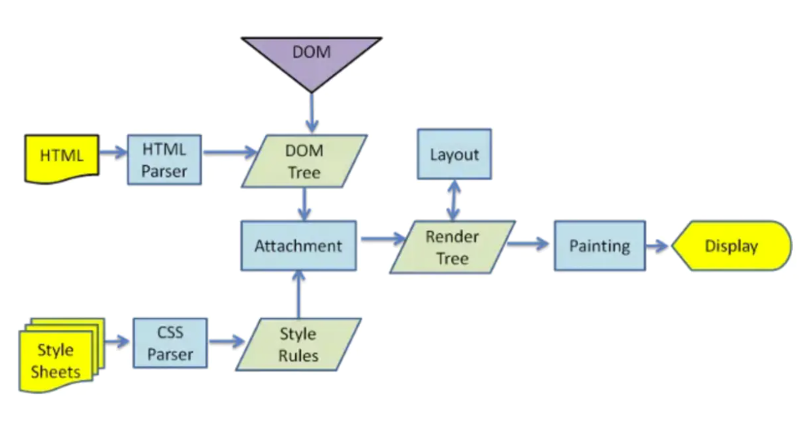

# 浏览器相关知识点

### 浏览器

主要组成部分：

* 用户界面： 地址栏、返回、书签等控件
* 数据持久化： cookie、 localstorage
* 浏览器引擎： 平台应用相关结构，承担UI和渲染引擎的交互、控制
* 渲染引擎： HTML和CSS解析和渲染
* JS引擎（解释器）： 解析、执行JS代码
* 用户界面后端： 图形库
* 网络： 调用网络，如HTTP请求

其中浏览器内核包括渲染引擎和JS引擎两部分。

### 浏览器渲染机制

##### 过程

> 1. HTML和CSS经过各自的解析器，（词法、语法分析，转成AST树）转换成DOM树和CSSOM树
> 2. 合并为渲染树
> 3. 根据渲染树进行布局
> 4. 调用GPU进行绘制，然后显示到屏幕上

##### 优化首屏加载速度

**优化文件大小**： HTML和CSS的加载和解析会阻塞渲染树的生成，从而影响首屏展示速度，因此我们可以通过优化文件大小、减少CSS文件层级的方法来加快首屏速度

**避免资源下载阻塞文档解析**：浏览器解析到<script>标签时，会阻塞文档解析，直到脚本执行完成，因此我们通常把<script>标签放在底部，或者加上`defer、async`来进行异步下载

##### 回流（重排）的概念

当元素的尺寸或者位置发生变化时，需要重新计算渲染树，也就是回流

触发回流的因素：

* DOM元素的几何属性： width / height / padding / margin / border
* DOM元素的移动或者增加
* 读写 offset / scroll / client 等属性时
* 调用`window.getComputedStyle`

##### 重绘的概念

DOM样式发生变化而没影响DOM的几何属性时，会触发重绘，而不会触发回流。重绘由于DOM位置信息不需要更新，省去了布局过程，因而性能上优于回流

##### GPU加速

使用transform opacity filters等属性时，GPU可以直接完成处理，这些处理不会导致回流和重绘。不过有个缺点就是GPU渲染等字体会模糊，过多的GPU处理有内存问题。

##### 优化： 减少回流、重绘

* 使用class 替代style，减少style的使用
* resize、scroll操作时，使用防抖和节流处理，这两者会直接导致回流
* 使用visibility替代display: none，前者只会触发重绘，后者会触发回流
* 批量修改元素时，可以使元素先脱离文档流，修改后再放入。
* 复杂动画效果，使用绝对定位，脱离文档流。复杂的动画会频繁触发回流/重绘，脱离文档流后可以避免这个问题。